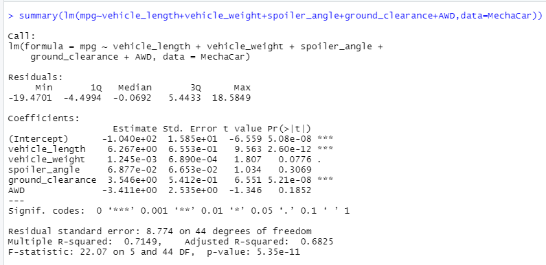
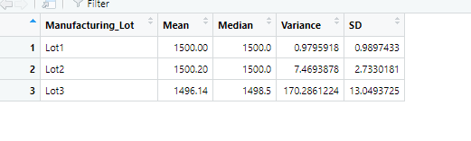
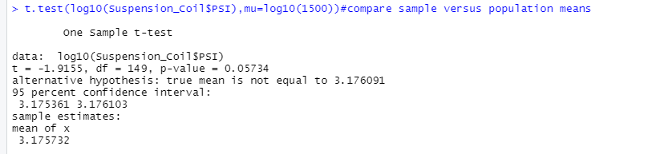
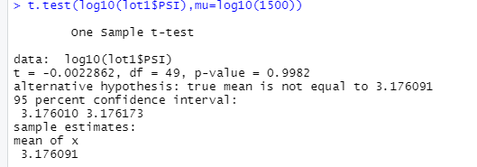
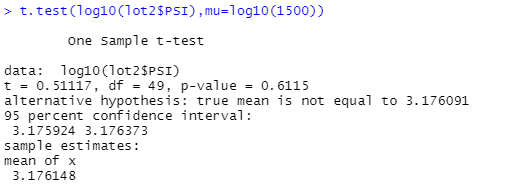
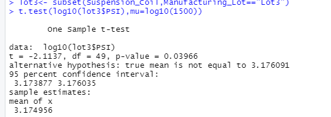

# MechaCar_Statistical_Analysis

## Linear Regression to Predict MPG

As we can see from above picture with all details from our linear regression model to predict MPG, we can tell that vehicle_lenth,ground_clearance and the Intercept are statisticially unlikely to provide random amounts of variance to the mpg values in this linear regression model.
We cannot consider the slope of this linear model zero. We have the p-value for 5.35e-11, which is much less than our significance level(0,05) which means we would reject the null hypothesis saying the slope of the linear model is zero.
This linear model is able to predict MPG of MechaCar prototypes effectively since the R-squared value is 0,7149 which indicates that about 71% of MPG prediction is correct!

## Summary Statistics on Suspension Coils
                              
                                     
The total_summary and lot_summary have listed as shown above.Firstly, let us look at the data from total_summary. The mean is 1498.78 pounds and the variance is about 62.29 pounds. 62.29 is within the requirement of 100 pounds so that the current overall manufacturing data meet this design specification for all manufacturing lots in total.
Furthermore, let's focus on the lot_summary. While lot1 and lot2 are having the mean of about 1500 pounds perfectly and their variance are only about 0.97 and 2.733 respectively which is a impressive , lot3 have the mean of 1496.14 pounds but with about 170.28 varience. Overall, lot 1 and lot 2 have meet the design specification and lot 3 is not meeting the requirement.

## T-Tests on Suspension Coils

The t test results for all and different lots seperately have shown above.
The p-value for t test result for all lots is about 0.057, is above the our significance level which indicates that there is no statistical difference between the observed sample mean and its presumed population mean(1500).
As for three lots, the p-values are 0.9982, 0.6115 and  0.03966 resepectively. It turns out that the result from data of lot 1 and lot 2 states that there is no statistical difference between them and its poplation mean(1500). Again for lot 3, the p value is 0.03966, which is below our significance level. It means that there is statisticacl difference between its data and its population mean.

## Study Design: MechaCar vs Competition
I believe most consumer would pay more attention to cost, fuel efficiency for city or highway, maintenance cost and safety rating and we are going to analyze based on the data of these factors. The null hypothesis sold number of vehicles is not related to these factors and the alternative hypothesis would be sold number of vehicle is realted to these factors. 
I would need choose to create a linear regression model to testify my hypothesis. I would like to have a formula from linear model to see what factors are strong related to the number of sold cars and what factors are not. Just like what we did in deliverable 1, we could observe the p-value for each of the factors and look at it as a whole by R-squared value. We would need the data for all the factors I mentioned above, and the data of number of sold cars so that we could easily build the linear model and see we can reject or fail to reject the null hypothesis with our results.

